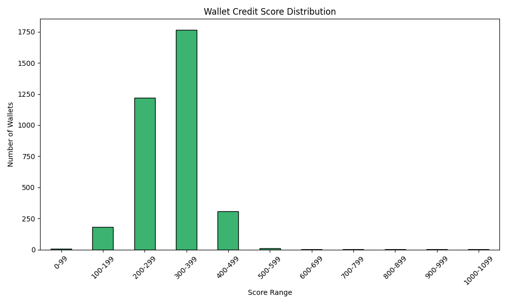

# Wallet Credit Score Analysis

## Score Distribution

### Score Ranges and Wallet Counts
- **0-99**: 7 wallets
- **100-199**: 180 wallets
- **200-299**: 1220 wallets
- **300-399**: 1765 wallets
- **400-499**: 308 wallets
- **500-599**: 9 wallets
- **600-699**: 4 wallets
- **700-799**: 1 wallets
- **800-899**: 1 wallets
- **900-999**: 1 wallets
- **1000-1099**: 1 wallets

## Behavioral Insights
### Lower Range Wallets (0�300)
Wallets in the lower range (0�300) typically exhibit poor financial behavior, such as high liquidation events, low deposits, minimal repayments, and irregular activity.

### Higher Range Wallets (800�1000)
Wallets in the higher range (800�1000) show consistent and positive financial activity, such as regular deposits, high repayment ratios, low liquidation, and well-diversified assets.
